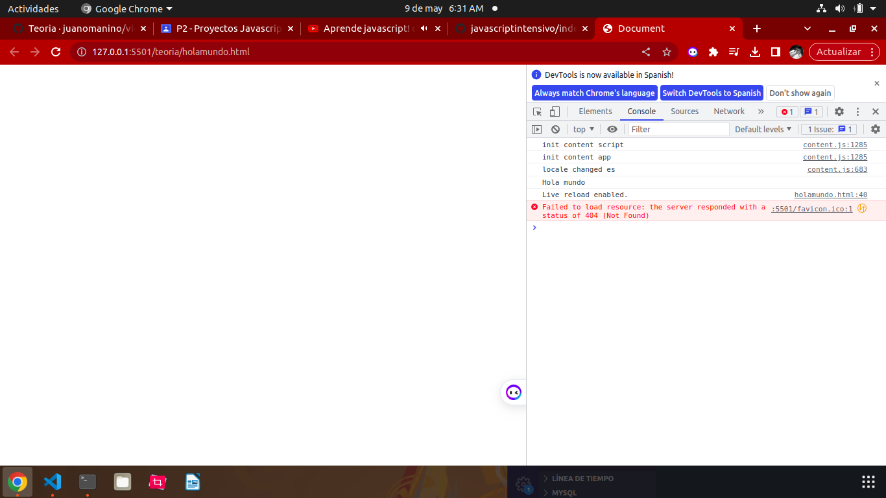
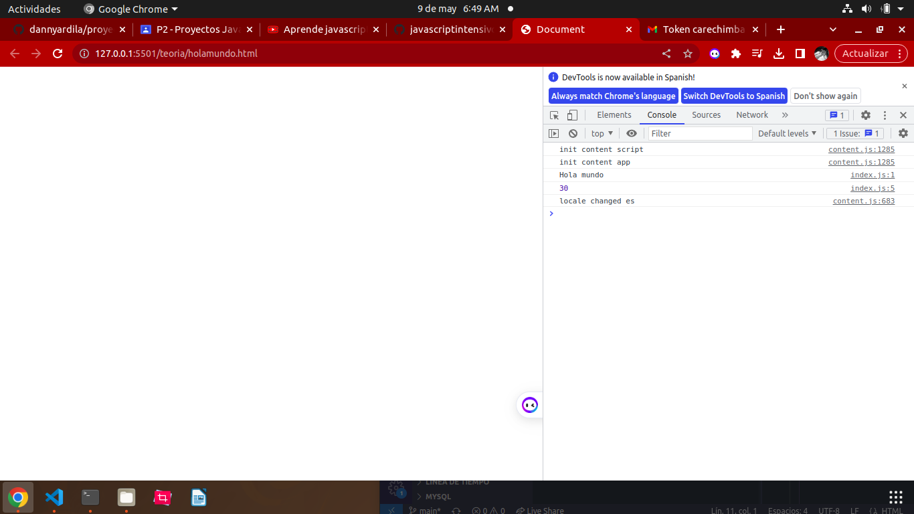
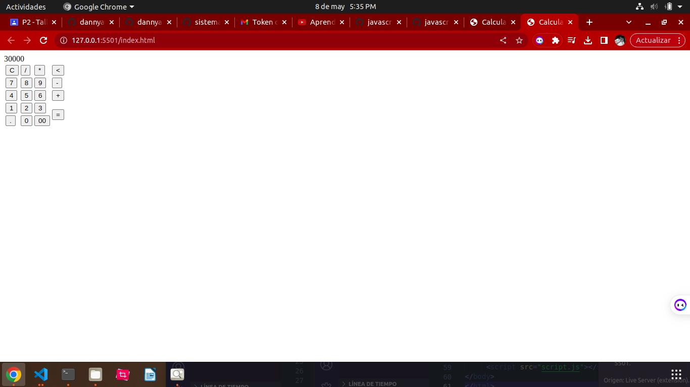
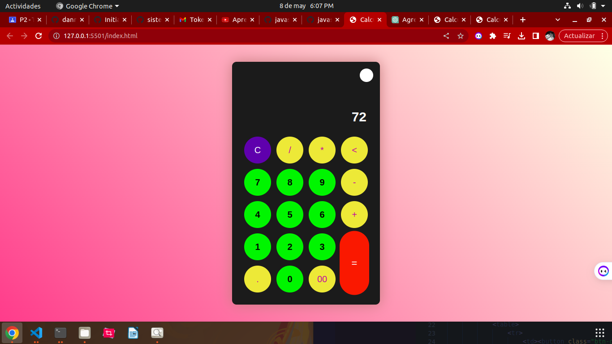
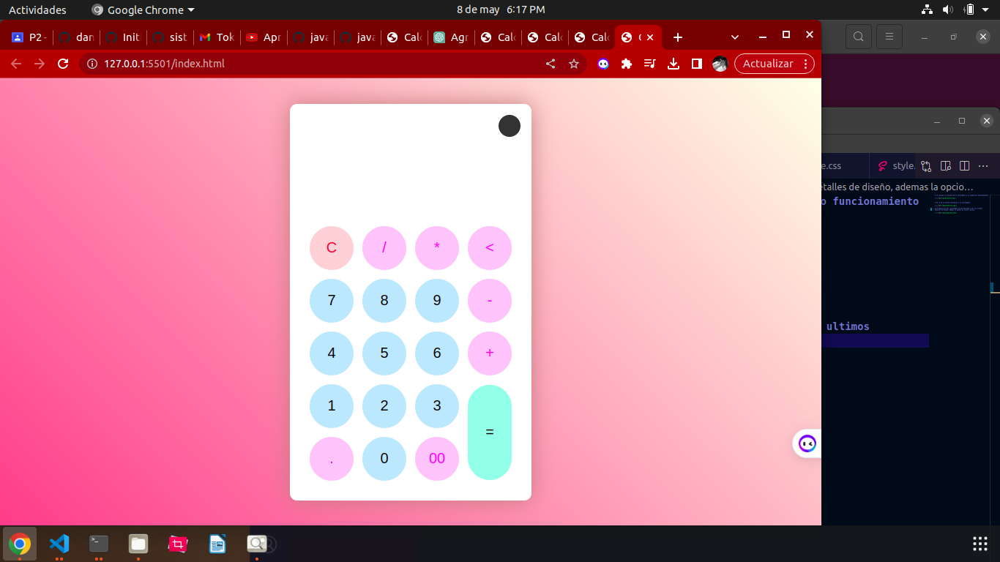
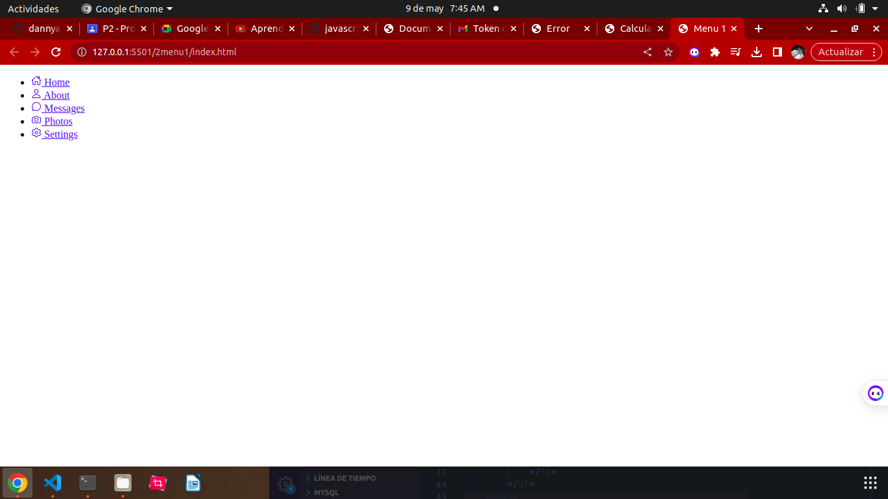
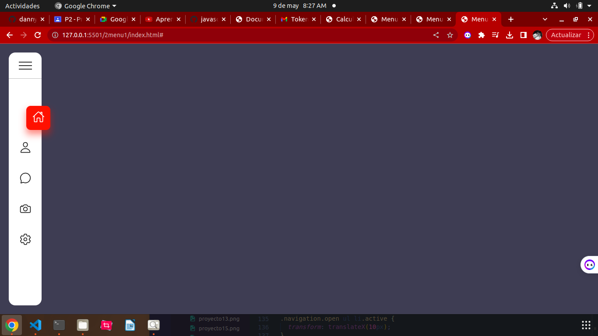

# Teoria
## Hace un pequeño ejemplo de hola mundo

## ejemplos de variables en la suma de dos numeros

# Proyecto 1
## calculadora

# se colocan los botones de la calculadora y su respectivo funcionamiento

# Se le da un diseño preliminar a la calculadora

# Se observa ya una calculadora ya mas decorada y con los ultimos detalles de diseño, ademas la opcion de claro o oscuro.

# Proyecto 2
# Menu lateral

## Se hace el diseño de este menu y se le agregan los titulos y opciones que va a llevar.

## se le da un estilo al menu lateral y se le agregan iconos de las determinadas funciones, ademas se le da un funcionaidad a el menu.

## 