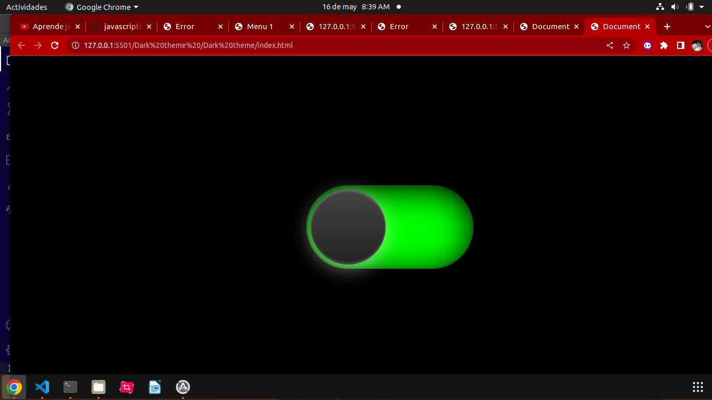

# Teoria
## Hace un pequeño ejemplo de hola mundo

## ejemplos de variables en la suma de dos numeros

# Proyecto 1
## calculadora

# se colocan los botones de la calculadora y su respectivo funcionamiento

# Se le da un diseño preliminar a la calculadora

# Se observa ya una calculadora ya mas decorada y con los ultimos detalles de diseño, ademas la opcion de claro o oscuro.

# Proyecto 2
# Menu lateral

## Se hace el diseño de este menu y se le agregan los titulos y opciones que va a llevar.

## se le da un estilo al menu lateral y se le agregan iconos de las determinadas funciones, ademas se le da un funcionaidad a el menu.

## Por ultimo el menu lateral queda completamente funcionable, y con un estilo, el cual se puede modificar.

# Proyecto 3

# Toggle 

## Se hace la maquetacion del toggle, y ejemplo del texto que va a aparecer en el toggle

## se vincula el texto, de la pagina con el respectivo toggle y se le da una maquetacion

## por ultimo se vincula el texto con el boton y eso hara que  al presionar el boton, aparezca respectivo texto

# Dark theme 4

## Switch cambia de color

## se hace un diseño del switch

## se implementan funcionalidad a el swicht y se le da decoracion

## Se le da un diseño final  a el switch y tambien la respectiva funcionalidad de cambiar el color de la pantalla 

# Menu desplegable 5

## Un menu comercial el cual puedes usar en movil y en computador

## se hace una maquetacion de lo que va hacer esta pagina de inicio y el menu lateral

## se le añade decoracion a esta pagina web "colores"

## Se añade la funcionalidad y el respectivo boton del menu lateral "ultimos retoques" y el resposite web designe 

