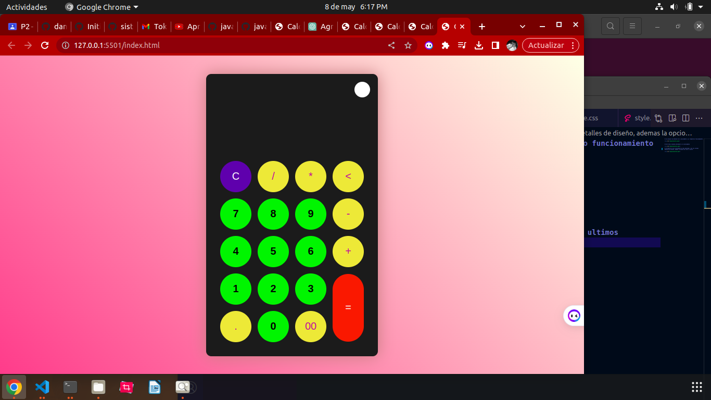

# Teoria
## Hace un pequeño ejemplo de hola mundo

## ejemplos de cvariables var

# se colocan los botones de la calculadora y su respectivo funcionamiento

# Se le da un diseño preliminar a la calculadora

# Se observa ya una calculadora ya mas decorada y con los ultimos detalles de diseño, ademas la opcion de claro o oscuro.

